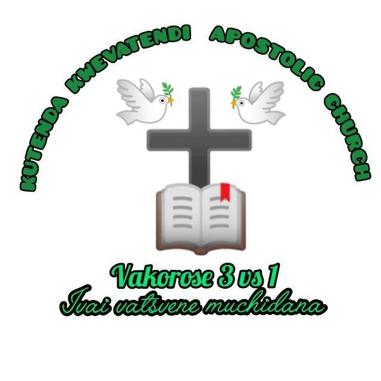
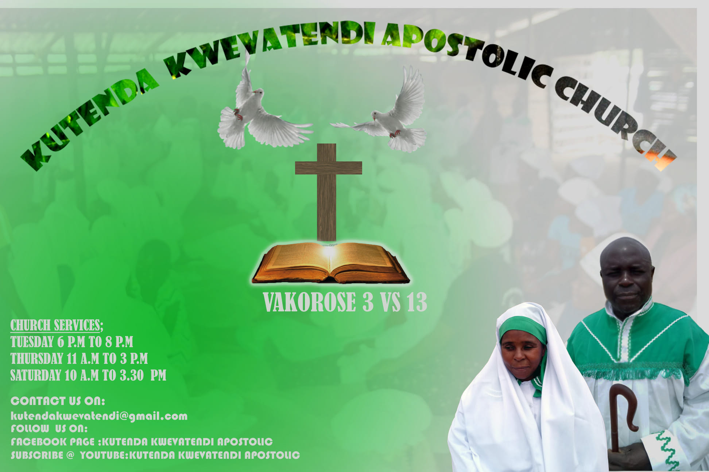
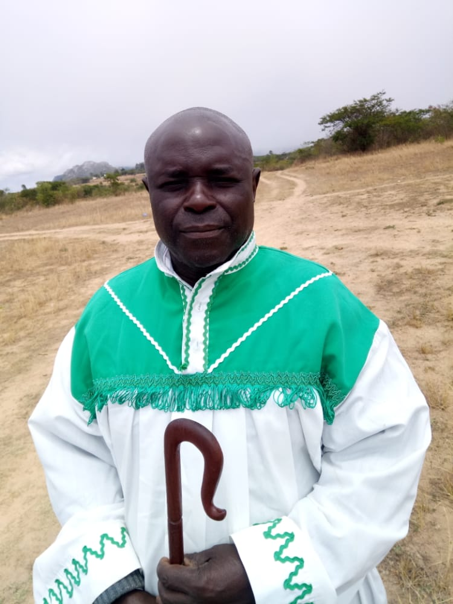
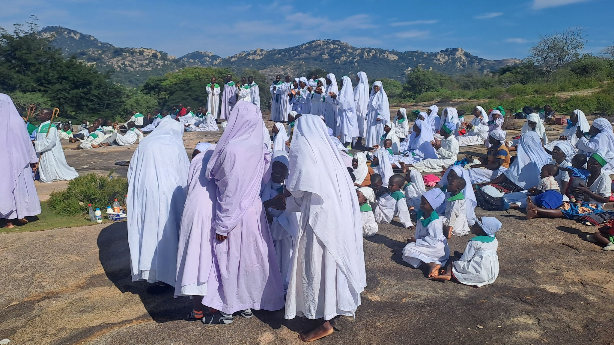
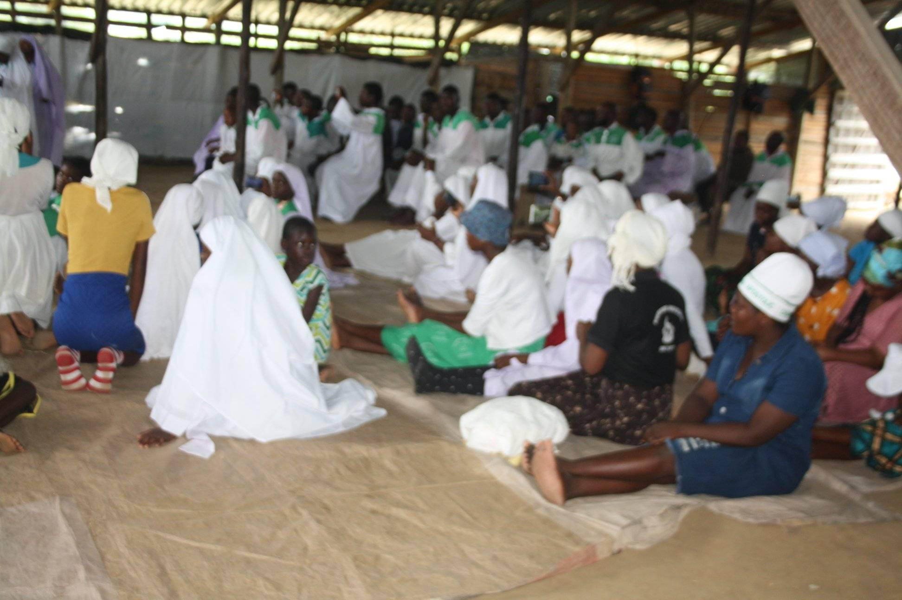
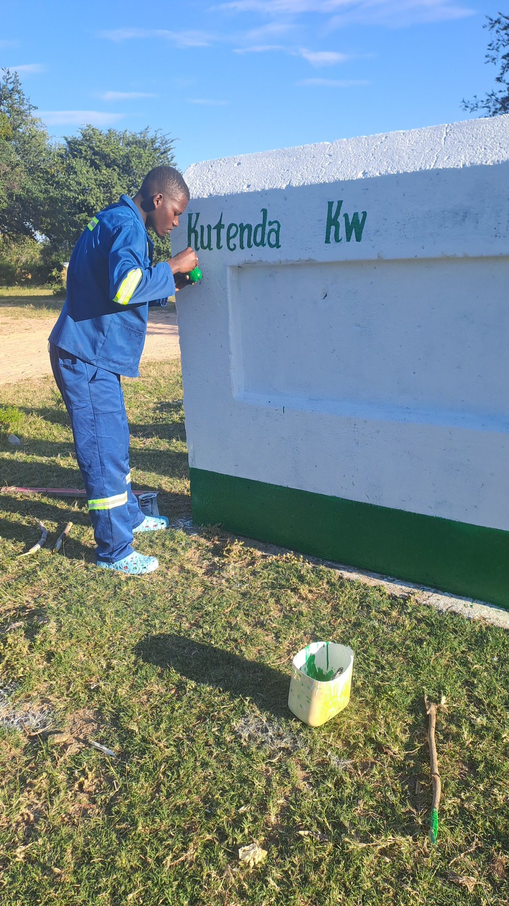

<head>
  <meta charset="UTF-8">
  <meta name="viewport" content="width=device-width, initial-scale=1.0">
  <title>Kutenda Kwevatendi Apostolic Church</title>
  <link rel="icon" href="favicon.ico">
  <meta name="description" content="Official Website for Kutenda Kwevatendi Apostolic Church. Learn about our faith, events, and community.">
  <meta name="keywords" content="Kutenda Kwevatendi, Apostolic Church, Zimbabwe Church, Faith, Worship">
  <meta name="author" content="kiven samwanda">
  
</head>
<body>
  <header>
    <h1>Kutenda Kwevatendi Apostolic Church</h1>
    <nav>
      <ul>
        <li><a href="#about">About Us</a></li>
        <li><a href="#gallery">Gallery</a></li>
        <li><a href="#videos">Videos</a></li>
        <li><a href="#contact">Contact</a></li>
        <li><a href="#social">Follow Us</a></li>
      </ul>
    </nav>
  </header>  <section id="about">
    <h2>About Our Church</h2>
    
Welcome to Kutenda Kwevatendi Apostolic Church. We are a vibrant Christian community grounded in faith, prayer, and love. Our mission is to bring people closer to God through worship, teaching, and fellowship.

       
  </section>  <section id="gallery">
    <h2>Image Gallery</h2>
    

      
      
      
      
        
    

  </section>  <section id="videos">
    <h2>Upcoming Events</h2>
     <h3>Women Conference 2025 Edition</h3>
    
From 25 to 28 October 2025

    
Address: Hillsview Chikanga Tm, Mutare, Zimbabwe

    <h4>GUEST SPEAKER</h4> ;
Mbuya Mutumwa Mariko

  </section>  <section id="contact">
    <iframe>
      https://maps.app.goo.gl/PMCSJa1uojjpn1ag9
    </iframe>
    <h2>Contact Us</h2>
    
Email: <a href="mailto:info@kutendakwevatendi.org">info@kutendakwevatendi.org</a>

    
Phone: +263 77 123 4567

    
Address: Chikanga, Mutare, Zimbabwe

    
WhatsApp: <a href="https://wa.me/263783543541" target="_blank">Chat with us on WhatsApp</a>

  </section>  <section id="social">
    <h2>Follow Us on Social Media</h2>
    <ul>
      <li><a href="https://www.facebook.com/kutendakwevatendi" target="_blank">Facebook</a></li>
      <li><a href="https://www.instagram.com/kutendakwevatendi" target="_blank">Instagram</a></li>
      <li><a href="https://twitter.com/kutendakwevatendi" target="_blank">Twitter</a></li>
      <li><a href="https://www.youtube.com/@kutendakwevatendi" target="_blank">YouTube</a></li>
    </ul>
  </section>  <footer>
    
&copy; 2025 Kutenda Kwevatendi Apostolic Church. All rights reserved.

  </footer>
</body>
</html>

